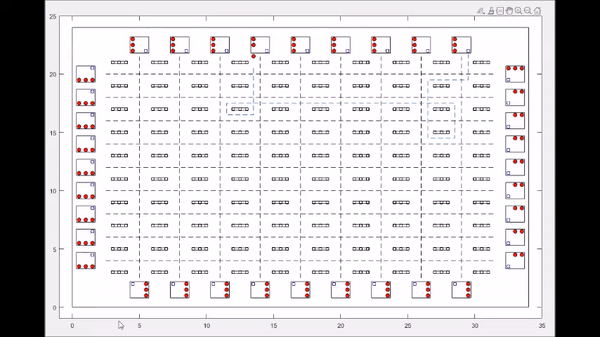

# Robot-simulation-in-a-warehouse-environment

Just run mainfunc.m

This is the simulation code for the task allocation and path planning of many robots in a large-size warehouse environment. If you use this code for your research, please cite

@inproceedings{shi2021task, 
title={Task Allocation and Path Planning of Many Robots with Motion Uncertainty in a Warehouse Environment},
author={Shi, Yinbin and Hu, Biao and Huang, Ran },  
booktitle={International Conference on Real-time Computing and Robotics},  
year={2021},  
organization={IEEE}  
}
 

Simulation 

